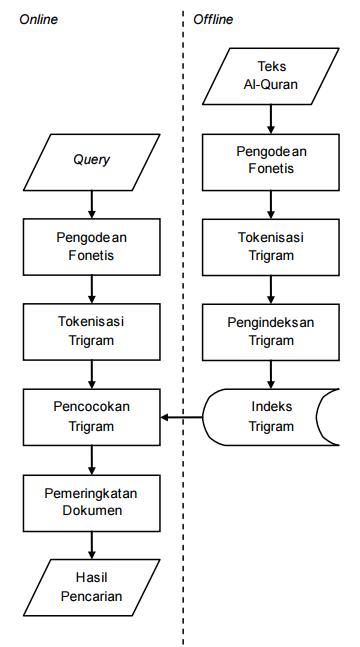

# Lafzi Indexer

Ini adalah repositori kode untuk mengindeks teks Al-Quran dengan pengkodean fonetis Lafzi (bagian kanan pada diagram di atas). Pengindeksan hanya perlu dilakukan sekali dan offline. Hasil indeks ini digunakan untuk pencarian. Versi ini versi baru, menggunakan teks Quran dengan rasm Utsmani, sementara yang terdahulu menggunakan teks Quran "simple". 

Source code untuk transformasi ke kode fonetis ada pada file `lib/fonetik.php`.

Keterangan isi folder yang mengandung data:
- tanzil: Data teks Quran (uthmani) dari tanzil.net dalam bentuk JSON beserta nama surat
- data: Hasil pemrosesan data dari tanzil menjadi file txt.
- index: Hasil pengkodean fonetis dan hasil indexing berada di folder ini.

Menjalankan
---

Langkah-langkah untuk membentuk indeks:

1. Jalankan `process_tanzil.php` untuk membaca teks Quran dari tanzil sekaligus transformasi huruf-huruf *muqattha'at*.
2. Jalankan `generate_corpus.php` dengan parameter `V` atau `NV` (dengan vokal atau tanpa vokal) untuk mengkodekan teks Quran menjadi kode fonetis Lafzi.
3. Jalankan `indexer.php` dengan parameter `V` atau `NV` untuk menyusun indeks dari kode fonetis.

Seluruh script PHP merupakan PHP yang dijalankan di command line, bukan browser.

Lisensi
---

GPL (GNU General Public License) v3. Anda bebas menggunakan, memodifikasi, dan mendistribusikan software ini dengan syarat tetap menjadikannya *open-source*.
